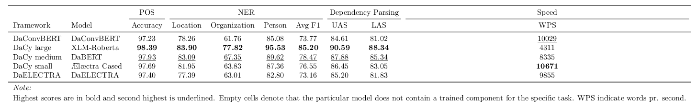

# DaCy Training
This folder contains the resources for training DaCy models. The `configs` folder includes all the configs used for all the models. While the `proeject.yml` include the workflows used for training the models, with each model containing its own workflow. These workflows and their subcommands can be called using `spacy project run [WORKFLOW/COMMAND]`. 

The `requirements.txt` includes the requirements for running the projects, note that these are installed using the workflow in the `project.yml` som you are unlikely to need to install these manually (with the exception of spacy).

## Performance
The following table shows the performance on the DaNE dataset of models trained for DaCy. Highest scores are highlighted with **bold** and the second highest is <ins>underlined</ins>. The models which do not have a DaCy name is not included in DaCy as faster and better performing models were available. E.g. while the ConvBert model are fast their don't compare favourably to the Ælæctra Model.

Where the following models are trained by:

- XLM-Roberta-Large: Facebook
- DaConvBERT: Philip Tamimi-Sarnikowski
- DaELECTRA: Philip Tamimi-Sarnikowski
- Ælæctra (cased and uncased): Malte Højmark-Bertelsen
- DaBERT: BotXO (supplied on Huggingface model hub by Malte Højmark-Bertelsen)

# Training Report

For reproducibility it is possible to view a report on the training of models in DaCy on [here](https://wandb.ai/kenevoldsen/dacy-an-efficient-pipeline-for-danish/reports/DaCy-Training-performances--Vmlldzo1NDgyNzk?accessToken=bavawchq2sfno773xne0texhk5ni6mh018ft3ghxg5la36tn7xr91mxapq4lshec).
