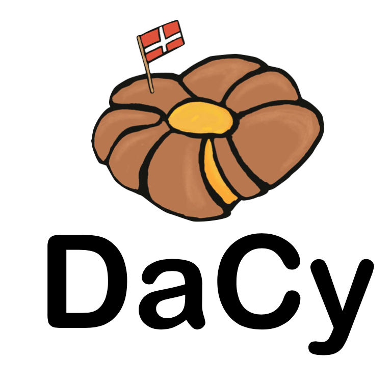

<a href="https://explosion.ai"></a>
# DaCy: A SpaCy NLP Pipeline for Danish


[](https://github.com/KennethEnevoldsen/DaCy)
[](https://github.com/KennethEnevoldsen/DaCy)
[](https://black.readthedocs.io/en/stable/the_black_code_style.html)
[](https://github.com/KennethEnevoldsen/DaCy)
[](https://spacy.io)
[](https://github.com/KennethEnevoldsen/Dacy/actions)

[](https://snyk.io/test/github/KennethEnevoldsen/DaCy)
[](https://kennethenevoldsen.github.io/DaCy/)
[](https://www.codefactor.io/repository/github/kennethenevoldsen/dacy)
<!-- 
<a href="https://doi.org/10.21105/joss.03153"></a>

[]()

-->

DaCy is a Danish preprocessing pipeline trained in SpaCy. At the time of writing it has achieved State-of-the-Art performance on all Benchmark tasks for Danish. This repository contains code for reproducing DaCy as well as download and loading the models. Furthermore, it also contains guides on how to use DaCy.
<!--
EASTER EGG:
https://www.youtube.com/watch?v=E7WQ1tdxSqI
-->

# 📰 News

- 0.4.1 (03/06/21)
  - DaCy now have a stunningly looking [documentation site](https://kennethenevoldsen.github.io/DaCy/) 🌟. It even got a dark mode!
- 0.3.1 (01/06/21)
  - DaCy's tests now cover 99% of its codebase 🎉
  - DaCy's test suite is now being applied for all major operating systems instead of just linux 👩‍💻
- 0.2.2 (25/05/21)
  - The new Danish Model [Senda](https://github.com/ebanalyse/senda) was added to DaCy
- 0.2.1 (30/03/21)
  - DaCy now includes a small model for efficient processing based on the Danish [Ælæctra](https://sprogteknologi.dk/dataset/918158b9-ac6b-4484-a44a-4e3de386dfca) 🏃
- 0.1.1 (24/03/21)
  - DaCy included wrapped version on major Danish sentiment analysis software including the models by [DaNLP](https://github.com/alexandrainst/danlp). As well as code for wrapping any sequence classification model into its pipeline 🤩
  - Tutorials is added to introduce the above functionality
- 0.0.1 (25/02/21)
  - DaCy launches with a medium-sized and a large language model obtaining state-of-the-art on Named entity recognition, part-of-speech tagging and dependency parsing for Danish 🇩🇰


<details>
  <summary>See older news items</summary>

- 0.0.1 (25/02/21)
  - DaCy launches with a medium-sized and a large language model obtaining state-of-the-art on Named entity recognition, part-of-speech tagging and dependency parsing for Danish 🇩🇰

</details>


# 🔧 Installation
it currently only possible to download DaCy directly from GitHub, however this can be done quite easily using:
```bash
pip install git+https://github.com/KennethEnevoldsen/DaCy
```

<details>
  <summary>Detailed instructions</summary>

  ### Install from source
  ```
  git clone https://github.com/KennethEnevoldsen/DaCy.git
  cd DaCy
  pip install .
  ```

</details>


# 👩‍💻 Usage
To use the model you first have to download either the small, medium, or large model. To see a list of all available models:

```python
import dacy
for model in dacy.models():
    print(model)
# da_dacy_small_tft-0.0.0
# da_dacy_medium_tft-0.0.0
# da_dacy_large_tft-0.0.0
```

To download and load a model simply execute:
```python
nlp = dacy.load("da_dacy_medium_tft-0.0.0")
```

Which will download the model to the `.dacy` directory in your home directory. 


To download the model to a specific directory:
```python
dacy.download_model("da_dacy_medium_tft-0.0.0", your_save_path)
nlp = dacy.load_model("da_dacy_medium_tft-0.0.0", your_save_path)
```

For more on how to use DaCy please check out our [documentation)

# 👩‍🏫 Tutorials and documentation

DaCy also include a detailed documentaion as well as a series of Jupyter notebook tutorial. If you do not have Jupyter Notebook installed, instructions for installing and running it can be found [here]( http://jupyter.org/install). All the tutorial are located in the `tutorials` folder.

|                                                                                                                                                      | Content                                                                                                                    | Google Colab                                                                                                                                                                                                       |
| ---------------------------------------------------------------------------------------------------------------------------------------------------- | -------------------------------------------------------------------------------------------------------------------------- | ------------------------------------------------------------------------------------------------------------------------------------------------------------------------------------------------------------------ |
| [🌟 Getting Started](https://kennethenevoldsen.github.io/DaCy/usingdacy.html)                                                                         | An introduction on how to use DaCy                                                                                         |                                                                                                                                                                                                                    |
| [📖 Documentation](https://kennethenevoldsen.github.io/DaCy/)                                                                                         | The Documentation of DaCy                                                                                                  |                                                                                                                                                                                                                    |
| [😡😂 Sentiment](https://github.com/KennethEnevoldsen/DaCy/blob/main/tutorials/dacy-sentiment.ipynb)                                                   | A simple introduction to the new sentiment features in DaCy.                                                               | [](https://colab.research.google.com/github/KennethEnevoldsen/DaCy/blob/main/tutorials/dacy-sentiment.ipynb)                             |
| [😎 wrapping a fine-tuned Tranformer](https://github.com/KennethEnevoldsen/DaCy/blob/main/tutorials/dacy-wrapping-a-classification-transformer.ipynb) | A guide on how to wrap an already fine-tuned transformer to and add it to your SpaCy pipeline using DaCy helper functions. | [](https://colab.research.google.com/github/KennethEnevoldsen/DaCy/blob/main/tutorials/dacy-wrapping-a-classification-transformer.ipynb) |


# 🦾 Performance and Training

The following table shows the performance on the DaNE dataset when compared to other models. Highest scores are highlighted with **bold** and second highest is <ins>underlined</ins>. 

<div align="center"></div>


<details>
  <summary> Training and reproduction </summary>

the folder `DaCy_training` contains a SpaCy project which will allow for a reproduction of the results. This folder also includes the evaluation metrics on DaNE and scripts for downloading the required data. For more information please see the training [readme](DaCy_training/readme.md).

Want to learn more about how the model was trained, check out this [blog post](https://www.kennethenevoldsen.com/post/new-fast-and-efficient-state-of-the-art-in-danish-nlp/).

</details>


# 🤔 Issues and Usage Q&A

To ask questions, report issues or request features, please use the [GitHub Issue Tracker](https://github.com/KennethEnevoldsen/DaCy/issues). Question related to SpaCy is kindly referred to the SpaCy GitHub or forum.

## FAQ


<details>
  <summary>Where is my DaCy model located?</summary>

  To figure out where where your DaCy model is located you can always use:

  ```python
  where_is_my_dacy()
  ```

</details>

<details>
  <summary>Why doesn't the performance metrics match the performance metrics reported on the DaNLP GitHub?</summary>

The performance metrics by DaNLP gives the model the 'gold standard' tokenization of the dataset as opposed to having the pipeline tokenize the text itself. This allows for comparison of the models on an even ground regardless of their tokenizer, but inflated the performance in general. DaCy on the other hand reports the performance metrics using its own tokenization this makes the result closer to something you would see on a real dataset and doesreflect how tokenization influence your performance.


</details>

</details>

<details>
  <summary>How do i test the code and run the test suite?</summary>


DaCy comes with an extensive test suite. In order to run the tests, you'll usually want to clone the repository and build DaCy from source. This will also install the required development dependencies and test utilities defined in the requirements.txt.


```
pip install -r requirements.txt
pip install pytest

python -m pytest
```

which will run all the test in the `dacy/tests` folder.

To run a specific test for instance if you wish to run the test on the readability functions, you can run:

```
python -m pytest dacy/tests/test_readability.py
```

**Code Coverage**
If you want check code coverage as well you can run the following:
```
pip install pytest-cov

python -m pytest--cov=.
```


</details>


<details>
  <summary>Why is vaderSentiment_da.py being excluded in the coverage test?</summary>

  It is excluded as the functionality is intended to move to another repository called sentida2, which is currently under development.
  
</details>


<details>
  <summary>Does DaCy run on X?</summary>

  DaCy is intended to run on all major OS, this include Windows (latest version), MacOS (Catalina) and the latest version of Linux (Ubuntu). Below you can see if DaCy passes its test suite for the system of interest. The first one indicated Linux. Please note these are only the systems DaCy is being actively tested on, if you run on a similar system (e.g. an earlier version of linux) it is likely that DaCy will run there as well.

| Operating System | Status                                                                                                                                                                                                                  |
| ---------------- | ----------------------------------------------------------------------------------------------------------------------------------------------------------------------------------------------------------------------- |
| Ubuntu (Latest)  | [](https://github.com/KennethEnevoldsen/DaCy/actions/workflows/pytest-cov-comment.yml)     |
| MacOS (Catalina) | [](https://github.com/KennethEnevoldsen/DaCy/actions/workflows/pytest_mac_catalina.yml) |
| Windows (Latest) | [](https://github.com/KennethEnevoldsen/DaCy/actions/workflows/pytest_windows.yml)            |

  
</details>


<details>
  <summary>How is the documentation generated?</summary>

  DaCy uses [sphinx](https://www.sphinx-doc.org/en/master/index.html) to generate documentation. It uses the [Furo](https://github.com/pradyunsg/furo) theme with a custom styling.

  To make the documentation you can run:
  
  ```
  # install sphinx, thems and extensions
  pip install sphinx furo sphinx-copybutton sphinxext-opengraph

  # generate html from documentations

  make -C docs html
  ```
  
</details>


## Acknowledgements
This is really an acknowledgement of great open-source software and contributors. This wouldn't have been possible with the work by the SpaCy team which developed an integrated the software. Huggingface for developing Transformers and making model sharing convenient. BotXO for training and sharing the Danish BERT model and [Malte Hojmark-Bertelsen](https://github.com/MalteHB) for making it easily available. DaNLP has made it extremely easy to get access to Danish resources to train on and even supplied some of the tagged data themselves and have done great job of developing these datasets.

## References

If you use this library in your research, please kindly cite:

```bibtex
@inproceedings{enevoldsen2020dacy,
    title={DaCy: A SpaCy NLP Pipeline for Danish},
    author={Enevoldsen, Kenneth},
    year={2021}
}
```

## License

DaCy is released under the Apache License, Version 2.0. See the [`LICENSE`](https://github.com/KennethEnevoldsen/DaCy/blob/main/LICENSE) file for more details.

## Contact
To contact the author feel free to use the application form on my [website](www.kennethenevoldsen.com) or contact me on social media. Please note that for issues and bugs please use the [GitHub Issue Tracker](https://github.com/KennethEnevoldsen/DaCy/issues).

[][twitter]
[][linkedin]

<br />

</details>

[twitter]: https://twitter.com/KCEnevoldsen
[linkedin]: https://www.linkedin.com/in/kennethenevoldsen/
