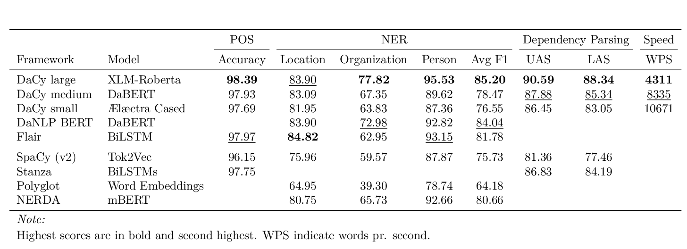

<a href="https://github.com/centre-for-humanities-computing/Dacy"></a>
# DaCy: An efficient NLP Pipeline for Danish

[](https://pypi.org/project/dacy/)
[](https://pypi.org/project/dacy/)
[](https://github.com/centre-for-humanities-computing/DaCy)
[](https://black.readthedocs.io/en/stable/the_black_code_style/current_style.html)
[](https://github.com/centre-for-humanities-computing/DaCy/blob/main/LICENSE)
[](https://spacy.io)
[](https://github.com/centre-for-humanities-computing/Dacy/actions)
[](https://centre-for-humanities-computing.github.io/DaCy/)

[](https://www.codefactor.io/repository/github/centre-for-humanities-computing/dacy)
[](https://huggingface.co/chcaa/da_dacy_medium_trf?text=DaCy+er+en+pipeline+til+anvendelse+af+dansk+sprogteknologi+lavet+af+K.+Enevoldsen%2C+L.+Hansen+og+K.+Nielbo+fra+Center+for+Humanities+Computing.)

<!-- 
[](https://snyk.io/test/github/KennethEnevoldsen/DaCy)
<a href="https://doi.org/10.21105/joss.03153"></a>

[]()

-->

DaCy is a Danish natural language preprocessing framework made with SpaCy. Its largest pipeline has achieved State-of-the-Art performance on Named entity recognition, part-of-speech tagging and dependency parsing for Danish. Feel free to try out the [demo](https://huggingface.co/chcaa/da_dacy_medium_trf?text=DaCy+er+en+pipeline+til+anvendelse+af+dansk+sprogteknologi+lavet+af+K.+Enevoldsen%2C+L.+Hansen+og+K.+Nielbo+fra+Center+for+Humanities+Computing.). This repository contains material for using the DaCy, reproducing the results and guides on usage of the package. Furthermore, it also contains behavioural tests for biases and robustness of Danish NLP pipelines.

<!--

EASTER EGG:
https://www.youtube.com/watch?v=E7WQ1tdxSqI

-->


# 📰 News
- 1.2.0 (04/11/21)
  - Removed DaNLP dependency, now DaNLP models is downloaded directly from Huggingface's model hub which is faster and more stable 🌟.
  - Removed the readability module, we recommend using the more extensive [textdescriptives](https://github.com/hlasse/TextDescriptives) package developed by [HLasse](https://github.com/HLasse) and I for extracting readability and other text metrics.
  - Added support for configuring the default save path with the environmental variable `DACY_CACHE_DIR` thanks to a PR by [dhpullack](https://github.com/dhpollack) 🙏.
- 1.1.0 (23/07/21)
  - DaCy is now available on the [Huggingface model hub](https://huggingface.co/models?search=dacy) 🤗 . Including detailed performance descriptions of biases and robustness.
  - It also got a brand new online [demo](https://huggingface.co/chcaa/da_dacy_medium_trf?text=DaCy+er+en+pipeline+til+anvendelse+af+dansk+sprogteknologi+lavet+af+K.+Enevoldsen%2C+L.+Hansen+og+K.+Nielbo+fra+Center+for+Humanities+Computing.) - try it out!
  - And more, including documentation update and prettier prints.
- 1.0.0 (09/07/21)
  - DaCy version 1.0.0 releases as the first version to pypi! 📦
    - Including a series of augmenters with a few specifically designed for Danish
    - Code for behavioural tests of NLP pipelines
    - A new tutorial for both 📖
    - The first paper on DaCy; check it out as a preprint and code for reproducing it [here](https://github.com/centre-for-humanities-computing/DaCy/tree/main/papers/DaCy-A-Unified-Framework-for-Danish-NLP)! 🌟 
  - A new beautiful hand-drawn logo 🤩
  - A test for biases and robustness in Danish NLP pipelines 🧐
  - DaCy is now officially supported by the [Centre for Humanities Computing](https://chcaa.io) at Aarhus University
- 0.4.1 (03/06/21)
  - DaCy now has a stunningly looking [documentation site](https://centre-for-humanities-computing.github.io/DaCy/) 🌟. It even has a dark mode!

To see older news items check out the [website](https://centre-for-humanities-computing.github.io/DaCy/).

# 🔧 Installation
To get started using DaCy simply install it using pip by running the following line in your terminal:
```bash
pip install dacy
```

The large version of DaCy uses the sentencepiece tokenizer and protobuf for serialization, to install both of these as well, simply run:

```bash
pip install dacy[large]
```

<br /> 

<details>
  <summary>Detailed instructions</summary>

  The default installation of DaCy does not install danlp as it have a lot dependencies which might collide with your packages you might wish to use. DaCy only uses danlp, for downloading its wrapped models for sentiment.
  If you wish to install DaNLP as well simply run:

  ```bash
  pip install dacy[danlp]
  ```


  to install all dependencies run
  ```bash
  pip install dacy[all]
  ```

  ### Install from source
  ```
  git clone https://github.com/centre-for-humanities-computing/DaCy.git
  cd DaCy
  pip install .
  ```

</details>

<br /> 


# 👩‍💻 Usage
To use the model you first have to download either the small, medium, or large model. To see a list of all available models:

```python
import dacy
for model in dacy.models():
    print(model)
# da_dacy_small_tft-0.0.0
# da_dacy_medium_tft-0.0.0
# da_dacy_large_tft-0.0.0
```

To download and load a model simply execute:
```python
nlp = dacy.load("da_dacy_medium_tft-0.0.0")
# or equivalently
nlp = dacy.load("medium")
```

Which will download the model to the `.dacy` directory in your home directory. 


To download the model to a specific directory:
```python
dacy.download_model("da_dacy_medium_tft-0.0.0", your_save_path)
nlp = dacy.load_model("da_dacy_medium_tft-0.0.0", your_save_path)
```

For more on how to use DaCy please check out our [documentation](https://centre-for-humanities-computing.github.io/DaCy/)

# 👩‍🏫 Tutorials and documentation

DaCy includes detailed documentation as well as a series of Jupyter notebook tutorial. If you do not have Jupyter Notebook installed, instructions for installing and running it can be found [here]( http://jupyter.org/install). All the tutorials are located in the `tutorials` folder.

|                                                                                                                                                      | Content                                                                                                                    | Google Colab                                                                                                                                                                                                       |
| ---------------------------------------------------------------------------------------------------------------------------------------------------- | -------------------------------------------------------------------------------------------------------------------------- | ------------------------------------------------------------------------------------------------------------------------------------------------------------------------------------------------------------------ |
| [🌟 Getting Started](https://centre-for-humanities-computing.github.io/DaCy/usingdacy.html)                                                                         | An introduction on how to use DaCy                                                                                         |                                                                                                                                                                                                                    |
| [📖 Documentation](https://centre-for-humanities-computing.github.io/DaCy/)                                                                                         | The Documentation of DaCy                                                                                                  |                                                                                                                                                                                                                    |
| [😡😂 Sentiment](https://github.com/centre-for-humanities-computing/DaCy/blob/main/tutorials/dacy-sentiment.ipynb)                                                   | A simple introduction to the new sentiment features in DaCy.                                                               | [](https://colab.research.google.com/github/centre-for-humanities-computing/DaCy/blob/main/tutorials/dacy-sentiment.ipynb)                             |
| [🍒 Augmentation](https://github.com/centre-for-humanities-computing/DaCy/blob/main/tutorials/dacy-augmentation.ipynb) | A guide on how to augment text using the DaCy and SpaCy augmenters. | [](https://colab.research.google.com/github/centre-for-humanities-computing/DaCy/blob/main/tutorials/dacy-augmentation.ipynb) |
| [⛑ Fairness and Robustness](https://github.com/centre-for-humanities-computing/DaCy/blob/main/tutorials/dacy-robustness.ipynb) | A guide on how to use augmenters to measure model robustness and biases using DaCy. | [](https://colab.research.google.com/github/centre-for-humanities-computing/DaCy/blob/main/tutorials/dacy-robustness.ipynb) |
| [😎 wrapping a fine-tuned Tranformer](https://github.com/centre-for-humanities-computing/DaCy/blob/main/tutorials/dacy-wrapping-a-classification-transformer.ipynb) | A guide on how to wrap an already fine-tuned transformer to and add it to your SpaCy pipeline using DaCy helper functions. | [](https://colab.research.google.com/github/centre-for-humanities-computing/DaCy/blob/main/tutorials/dacy-wrapping-a-classification-transformer.ipynb) |


# 🦾 Performance and Training

[](https://paperswithcode.com/sota/named-entity-recognition-on-dane?p=dacy-a-unified-framework-for-danish-nlp)
  
[](https://paperswithcode.com/sota/part-of-speech-tagging-on-dane?p=dacy-a-unified-framework-for-danish-nlp)
	
[](https://paperswithcode.com/sota/dependency-parsing-on-dane?p=dacy-a-unified-framework-for-danish-nlp)

The following table shows the performance on the DaNE test set when compared to other models. Highest scores are highlighted with **bold** and second highest is <ins>underlined</ins>. 

<div align="center"></div>

Stanza uses the spacy-stanza implementation. The speed on the DaNLP model is as reported by the framework, which does not utilize batch input. However, given the model size, it can be expected to reach speeds comparable to DaCy medium. Empty cells indicate that the framework does not include the specific model.

<br /> 

<details>
  <summary> Training and reproduction </summary>

the folder `training` contains a SpaCy project which will allow for reproduction of the results. This folder also includes the evaluation metrics on DaNE and scripts for downloading the required data. For more information, please see the training [readme](training/readme.md).

Want to learn more about how DaCy initially came to be, check out this [blog post](https://www.kennethenevoldsen.com/post/new-fast-and-efficient-state-of-the-art-in-danish-nlp/).

</details>

<br /> 

## Robustness and Biases
DaCy compares the performance of Danish language processing pipeline under a large variaty of augmentations to test the robustness and biases hereof. To find out more please check the [website](https://centre-for-humanities-computing.github.io/DaCy/robustness.html).

# 🤔 Issues and Usage Q&A

To ask report issues or request features, please use the [GitHub Issue Tracker](https://github.com/centre-for-humanities-computing/DaCy/issues). Questions related to SpaCy are kindly referred to the SpaCy GitHub or forum.  Otherwise, please use the [discussion Forums](https://github.com/centre-for-humanities-computing/DaCy/discussions).

## FAQ

 <br /> 


<details>
  <summary>Where is my DaCy model located?</summary>

  By default the models are located in `~/.dacy`. The location can be configured with the environmental variable `DACY_CACHE_DIR`.

  Additionally, to figure out where your DaCy model is located you can always use:

  ```python
  where_is_my_dacy()
  ```

</details>

<br /> 


<details>
  <summary>Why doesn't the performance metrics match the performance metrics reported on the DaNLP GitHub?</summary>

The performance metrics by DaNLP gives the model the 'gold standard' tokenization of the dataset as opposed to having the pipeline tokenize the text itself. This allows for comparison of the models on an even ground regardless of their tokenizer but inflated the performance in general. DaCy on the other hand reports the performance metrics using a tokenizer this makes the result closer to something you would see on a real dataset and does reflect how tokenization influence your performance. All models tested was tested either using their own tokenizer or SpaCy Danish tokenizer depending on which performed the best. All models except Stanza and Polyglot were found to perform best with the SpaCy tokenizer.
</details>

<br /> 

</details>

<details>
  <summary>How do I test the code and run the test suite?</summary>


DaCy comes with an extensive test suite. In order to run the tests, you'll usually want to clone the repository and build DaCy from the source. This will also install the required development dependencies and test utilities defined in the requirements.txt.


```
pip install -r requirements.txt
pip install pytest

python -m pytest
```

which will run all the test in the `dacy/tests` folder.

Specific tests can be run using:

```
python -m pytest dacy/tests/test_utils.py
```

**Code Coverage**
If you want to check code coverage you can run the following:
```
pip install pytest-cov

python -m pytest--cov=.
```


</details>

<br /> 

<details>
  <summary>Why is vaderSentiment_da.py being excluded in the coverage test?</summary>

  It is excluded as the functionality is intended to move to another repository called sentida2, which is currently under development.
  
</details>

<br /> 


<details>
  <summary>Does DaCy run on X?</summary>

  DaCy is intended to run on all major OS, this includes Windows (latest version), MacOS (Catalina) and the latest version of Linux (Ubuntu). Below you can see if DaCy passes its test suite for the system of interest. The first one indicated Linux. Please note these are only the systems DaCy is being actively tested on, if you run on a similar system (e.g. an earlier version of Linux) DaCy will likely run there as well.

| Operating System | Status                                                                                                                                                                                                                  |
| ---------------- | ----------------------------------------------------------------------------------------------------------------------------------------------------------------------------------------------------------------------- |
| Ubuntu (Latest)  | [](https://github.com/centre-for-humanities-computing/DaCy/actions/workflows/pytest-cov-comment.yml)     |
| MacOS (Catalina) | [](https://github.com/centre-for-humanities-computing/DaCy/actions/workflows/pytest_mac_catalina.yml) |
| Windows (Latest) | [](https://github.com/centre-for-humanities-computing/DaCy/actions/workflows/pytest_windows.yml)            |

  
</details>

<br /> 

<details>
  <summary>How is the documentation generated?</summary>

  DaCy uses [sphinx](https://www.sphinx-doc.org/en/master/index.html) to generate documentation. It uses the [Furo](https://github.com/pradyunsg/furo) theme with a custom styling.

  To make the documentation you can run:
  
  ```
  # install sphinx, themes and extensions
  pip install sphinx furo sphinx-copybutton sphinxext-opengraph

  # generate html from documentations

  make -C docs html
  ```
  
</details>

 <br /> 


## Acknowledgements
DaCy is a result of great open-source software and contributors. It wouldn't have been possible without the work by the SpaCy team which developed and integrated the software. Huggingface for developing Transformers and making model sharing convenient. BotXO for training and sharing the Danish BERT model and [Malte Hojmark-Bertelsen](https://github.com/MalteHB) for making it easily available and developing Ælæctra. A huge compliment also goes out to DaNLP which have made it easy to get access to Danish resources and even supplied some of the tagged data themselves.

## References

If you use this library in your research, please cite the [paper](https://arxiv.org/abs/2107.05295):

```bibtex
@misc{enevoldsen2021dacy,
      title={DaCy: A Unified Framework for Danish NLP}, 
      author={Kenneth Enevoldsen and Lasse Hansen and Kristoffer Nielbo},
      year={2021},
      eprint={2107.05295},
      archivePrefix={arXiv},
      primaryClass={cs.CL}
}
```

To read more on this paper or to see the code for reproducing the results please check out the associated [readme](papers/DaCy-A-Unified-Framework-for-Danish-NLP/readme.md).


## License

DaCy is released under the Apache License, Version 2.0. See the [`LICENSE`](https://github.com/centre-for-humanities-computing/DaCy/blob/main/LICENSE) file for more details.

## Contact
For feature request issues and bugs please use the [GitHub Issue Tracker](https://github.com/centre-for-humanities-computing/DaCy/issues). Otherwise, please use the [Discussion Forums](https://github.com/centre-for-humanities-computing/DaCy/discussions).

<!--
if we want a linkedin / twitter at some point
[][twitter]
[][linkedin] 

<br />

</details>

[twitter]: https://twitter.com/KCEnevoldsen
[linkedin]: https://www.linkedin.com/in/kennethenevoldsen/
-->
