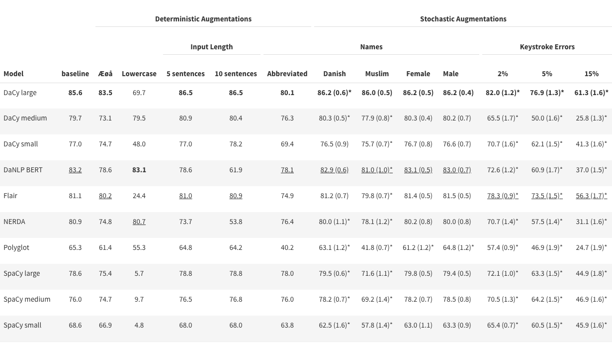
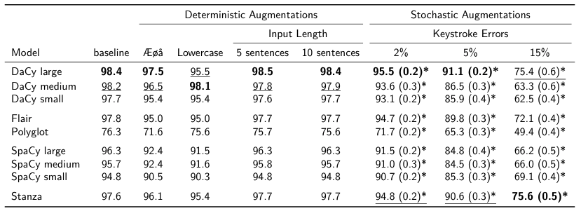
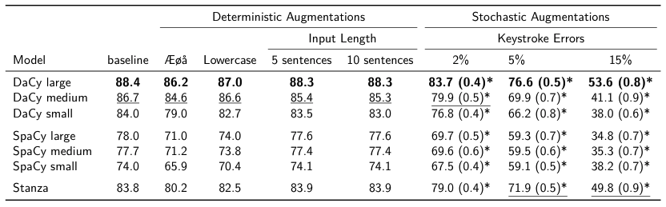

Robustness and Biases
=========================================

In the paper `DaCy: A Unified Framework for Danish NLP <https://github.com/centre-for-humanities-computing/DaCy/blob/main/papers/DaCy-A-Unified-Framework-for-Danish-NLP/readme.md>`__
we conduct a series on augmentation on the DaNE test set to estimate the robustness and biases of DaCy and other
Danish language processing pipelines. This page represent only parts of the paper for the full introduction, we naturally recommend reading the paper.
Let's start by examining a couple of the augmentation, namely changing out names or introducing plausible keytype errors.

.. admonition:: Example

   .. admonition:: Original
      :class: note

      Peter Schmeichel mener også, at det danske landshold anno 2021 tilhører verdenstoppen og kan vinde den kommende kamp mod England.

   .. admonition:: Female name augmentation
      :class: important

      Anne Østergaard mener også, at det danske landshold anno 2021 tilhører verdenstoppen og kan vinde den kommende kamp mod England.

   .. admonition:: 5% keytype errors
      :class: important

      Peter Schmeichel mener ogsål at det dansie landahold anno 2921 tilhører vefdrnstoppen og kan vonde den kimmende kamp mod England.
      

The underlying assumption of making these augmentation is that the tags of the sentence does not change with augmentation.
In our case this include that "Anna Østergaard" is still a person and that "vonde" still can be considered a verb based on its context.

Based on this we can assume that if a models performs worse on a given set of names or with minor spelling variation or errors we can conclude that we model are vulnerable to such input. 
For instance if the model has a hard time dealing replacing æ, ø, and å with ae, oe, and aa it might not be ideal to apply to historic texts.  

As seen in the above while some of these are reasonable for humans, others like the 15% keytype errors test the limit of
what humans and models can reasonably read.

.. admonition:: 15% keytype errors
   :class: important

   Peter Schmeichel mejer ogsp, at ddt danske landshoof anbo 202q tilhårer gerfenatop0en of lan vinde sen kpmkendw lamp mod England.

The following tables show a detailed breakdown of performance for named entity recognition, part-of-speech tagging and dependency parsing.
These show some general trends, some of which include:

* Spelling variations and abbreviated first names consistently reduce performance of all models on all tasks.

* Even simple replacements of æ, ø, and å with ae, oe, and aa lead to notable performance degradation.

* In general, larger models handle augmentations better than small models with DaCy large performing the best

* The BiLSTM-based models (Stanza and Flair) perform competitively under augmentations and are only consistently outperformed by DaCy large.

Named entity recognition
^^^^^^^^^^^^^^^^^^^^^^^^^^^^^^

In the following table we see a the performance on named entity recognition (NER) of Danish NLP pipelines
reported as average F1 scores excluding the MISC category. We have highlighted the best scores in
bold and second best are underlined. The "*" denotes that the result is significantly different 
from baseline using a significance threshold of 0.05 with Bonferroni correction for multiple comparisons.
Values in parentheses denote the standard deviation. 

.. hint::
   
   NERDA limits input size to 128 wordpieces which leads to truncation on long input sizes and when there is a high rates of keystroke errors.

Besides the general trends noted above we can also note that:

* All models show a bias toward male and Muslim names, except DaCy large and small. The robustness of DaCy large might stem from the multilingual pre-training and the model size, while for DaCy small it is likely the well-curated training data. 

* DaCy small is robust to spelling errors and outperforms larger models such as DaNLP's BERT and NERDA.

* DaNLP's BERT and NERDA models were found to under-perform if given longer input lengths.

* DaCy's models consistently perform slightly better with more context, but are not vulnerable to shorter input.

* Lack of casing is detrimental for NER for the cased models, most notably Flair, the SpaCy models, DaCy large and DaCy small. 

Part-of-speech tagging
^^^^^^^^^^^^^^^^^^^^^^^^^^^^^^

In the following table we see the accuracy of Danish NLP pipeline on part-of-speech tagging.

One might wonder why the performance is so high for part-of-speech-tagging have long had a performance around 97-98% and it is argued by `Manning (2011) <https://nlp.stanford.edu/pubs/CICLing2011-manning-tagging.pdf>`__ that obtaining greater accuracy requires updates to the training data rather than new architectures.

Dependency parsing
^^^^^^^^^^^^^^^^^^^^^^^^^^^^^^

In the following table we see the LAS score of Danish models for dependency parsing.

