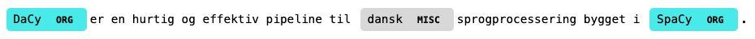
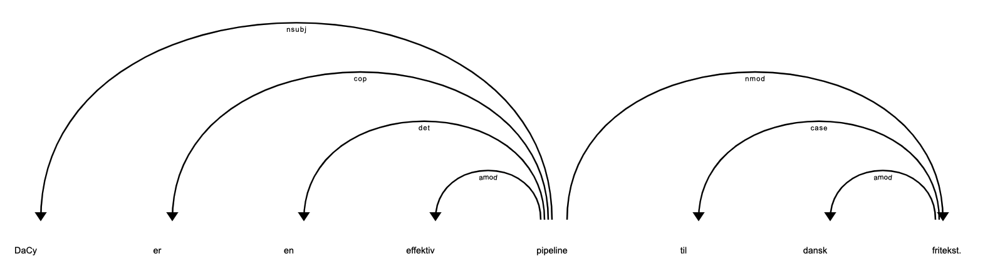

Getting Started
==================

.. |colab_tut| image:: https://colab.research.google.com/assets/colab-badge.svg
   :width: 140pt
   :target: https://colab.research.google.com/github/centre-for-humanities-computing/DaCy/blob/master/tutorials/dacy-basic.ipynb

|colab_tut|

To use the model you first have to download either the small, medium or large model. To see a list
of all available models:

.. code-block:: python

   import dacy
   for model in dacy.models():
      print(model)
   # ...
   # da_dacy_small_trf-0.1.0
   # da_dacy_medium_trf-0.1.0
   # da_dacy_large_trf-0.1.0

.. note::
   The name of the indicated language (:code:`da`), framework (:code:`dacy`), model size (e.g.
   :code:`small`), model type (:code:`trf`),and model version (:code:`0.1.0`)

From here we can now download a model using:

.. code-block:: python

   nlp = dacy.load("da_dacy_medium_trf-0.1.0")
   # or equivalently
   nlp = dacy.load("medium")

Which will download the model to the :code:`.dacy` directory in your home directory.
If the model is already downloaded the model will be loaded. To download
the model to a specific directory:

.. code-block:: python

   # Just download
   dacy.download_model("da_dacy_medium_trf-0.1.0", your_save_path)
   # Download and load
   nlp = dacy.load("da_dacy_medium_trf-0.1.0", your_save_path)

Using this we can now apply DaCy to text with conventional SpaCy syntax:

.. code-block:: python

   doc = nlp("DaCy er en hurtig og effektiv pipeline til dansk sprogprocessering bygget i SpaCy.")

.. seealso::

   DaCy is built using SpaCy, hence you will be able to find a lot of the required documentation for
   using the pipeline in their very well written `documentation <https://spacy.io>`__.

Named Entity Recognition
====================================
A named entity is a “real-world object” that's assigned a name - for example, a person, a country, a product or a book title. 
DaCy can recognize organizations, persons, and location, as well as other miscellaneous entities.

.. code-block:: python

   for entity in doc.ents:
      print(entity, ":", entity.label_)
   # DaCy : ORG
   # dansk : MISC
   # SpaCy : ORG

We can also plot these using:

.. code-block:: python

   from spacy import displacy
   displacy.render(doc, style="ent")

.. seealso::

   For more on named entity recognition see SpaCy's `documentation <https://spacy.io/usage/linguistic-features#named-entities>`__.

Since its release DaCy have been outperformed by `the state-of-the-art model for NER <https://huggingface.co/saattrupdan/nbailab-base-ner-scandi>`__
by Dan Nielsen. To allow users to access the best model for their use-case DaCy allows you to easily
switch the NER component to obtain a state-of-the-art model.
To do this you can simply load the model using:

.. code-block:: python

   # load the small dacy model excluding the NER component
   nlp = dacy.load("da_dacy_small_trf-0.1.0", exclude=["ner"])
   # or use an empty spacy model if you only want to do NER
   # nlp = spacy.blank("da")

   # add the ner component from the state-of-the-art model
   nlp.add_pipe("dacy/ner")

   doc = nlp("Denne NER model er trænet af Dan fra Alexandra Instituttet")

   for entity in doc.ents:
      print(entity, ":", entity.label_)

   # Dan : PER
   # Alexandra Instituttet : ORG

Do note that this will add an additonal model to your pipeline, which will slow down the inference speed.

Parts-of-speech Tagging
====================================

.. code-block:: python

   print("Token POS-tag")
   for token in doc:
      print(f"{token}: {token.pos_}")
   # Token POS-tag
   # DaCy:              PROPN
   # er:                AUX
   # en:                DET
   # hurtig:            ADJ
   # og:                CCONJ
   # effektiv:          ADJ
   # pipeline:          NOUN
   # til:               ADP
   # dansk:             ADJ
   # sprogprocessering: NOUN
   # bygget:            VERB
   # i:                 ADP
   # SpaCy:             PROPN
   # .:                 PUNCT

.. seealso::

   For more on Part-of-speech tagging see SpaCy's `documentation <https://spacy.io/usage/linguistic-features#pos-tagging>`__.

Dependency parsing
====================================
DaCy features a fast and accurate syntactic dependency parser. In DaCy this dependency parsing is also
used for sentence segmentation and detecting noun chunks.

You can see the dependency tree using:

.. code-block:: python

   doc = nlp("DaCy er en effektiv pipeline til dansk fritekst.")
   
   from spacy import displacy
   displacy.render(doc)

.. seealso::

   For more on dependency parsing with DaCy, especially on how to navigate the tree, see SpaCy's `documentation <https://spacy.io/usage/linguistic-features#dependency-parse>`__.

