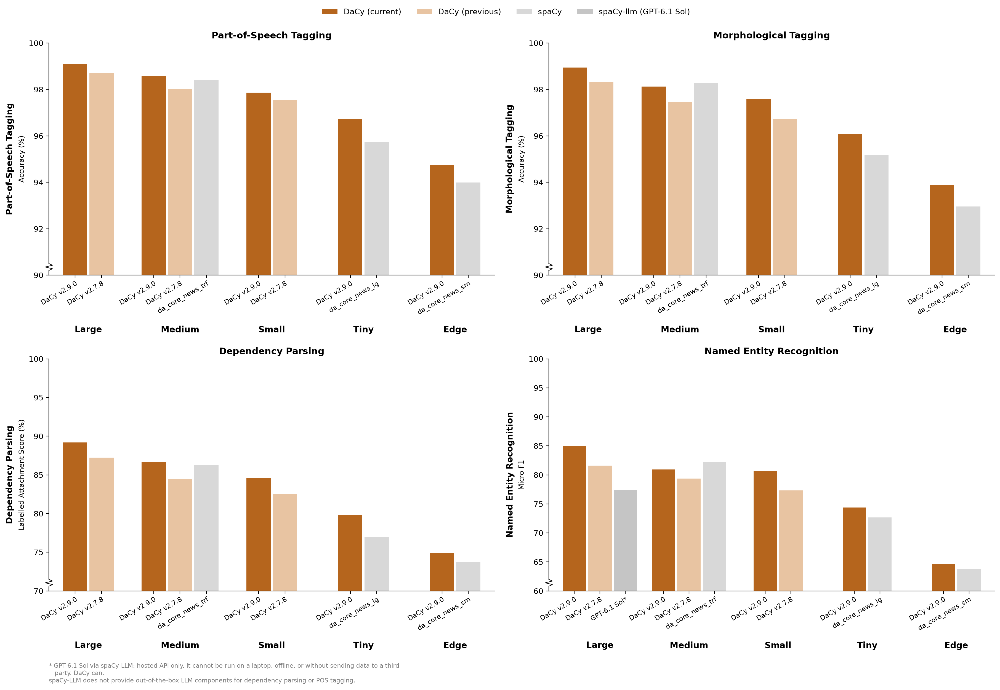
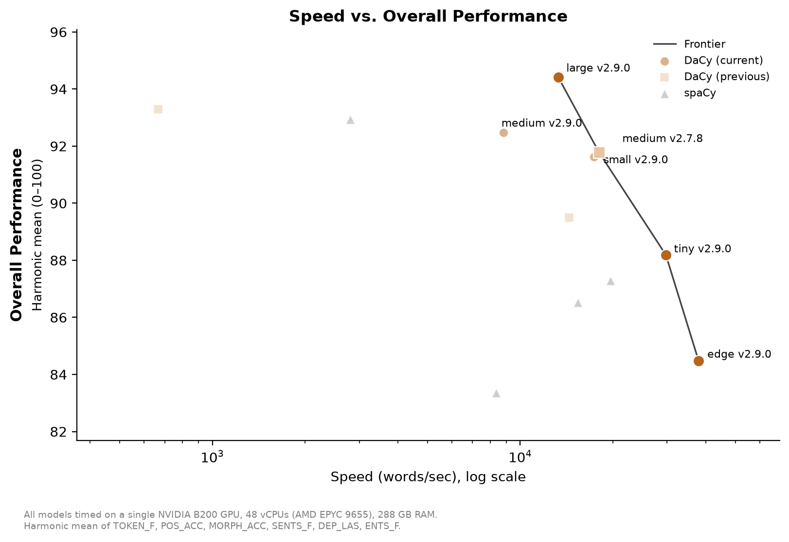

# Announcing DaCy v2.9.0: Efficient models and simpler dependencies

We are excited to announce the release of our new DaCy models, which both updates existing models and introduces two new models, *tiny* and *edge*, targeting efficient inference on CPU.

## Why update DaCy in an age of large language models?

Wouldn’t it be easier to just prompt an LLM and call it a day? Well, maybe. But you’d be missing out on performance while suddenly paying a premium in compute, time and/or tokens. Here’s a few reasons why DaCy is still worth your time:

DaCy is built specifically for Danish language processing. That means it’s both more accurate and more reliable than a general-purpose LLM designed to do a little bit of everything in every language. DaCy also comes with well-documented performance metrics, so you can see exactly which model fits your needs before you commit to one. Just as importantly, these metrics allow you to clearly document how you arrived at your research analysis. And since DaCy is built on spaCy, it fits seamlessly into spaCy’s ecosystem. If you know spaCy, you already know DaCy.

On top of that, DaCy is built with personal and local use in mind. It’s lightweight and self-contained, so that you can build your own NLP projects directly on top of it. You can even run DaCy locally without shipping data off to someone else’s server. And if your project ever outgrows that, DaCy scales up with ease.

And then there’s the data behind it all. DaCy is built on open, purpose-built data. We didn’t scrape the internet, and we didn’t snatch anyone’s work without permission. The data is sourced ethically with the explicit goal of training NLP models.

Finally, DaCy is free. Yes, really.

## Data curation

Creating models that can perform all of these tasks in a single forward pass requires a dataset which contains all of the relevant annotations in a single dataset. Luckily, for Danish we have the Danish Dependency Treebank ([DDT](https://github.com/UniversalDependencies/UD_Danish-DDT)) which contains part-of-speech, dependency and morphology annotations. DDT has also been annotated for entities by the Alexandra Institute in the [DaNE](https://huggingface.co/datasets/alexandrainst/dane) dataset. DDT is derived from the Copenhagen Dependency Treebank ([CDT](https://github.com/mbkromann/copenhagen-dependency-treebank)), converted to be consistent with the tags used in the Universal Dependencies project ([UD](https://universaldependencies.org/)). Sadly, this process split the data into individual sentences making it hard for models to utilize information across sentence boundaries. Although the datasets do not overlap exactly, we can merge the documents that do overlap, and as shown below, this notably improves downstream performance.

Including CDT also comes with two additional (future) benefits, namely that it allows us to also include the annotations for [DaNED](https://github.com/alexandrainst/danlp/blob/master/docs/docs/datasets.md#daned) for linking entities to known entities and [DaCoref](https://huggingface.co/datasets/alexandrainst/dacoref), for resolving coreferences (e.g., who does “she” refer to?).

As seen below, combining documents notably improves the quality yielding better dependency parsing and named entity recognition. We share this dataset publicly for everyone to use [here](https://huggingface.co/datasets/chcaa/dacy-data).

| Dataset | POS | NER F1 | LEMMA | SENTS F | MORPH | LAS | UAS |
|---|---|---|---|---|---|---|---|
| DDT + CDT (union) | **98.08** | **80.38** | **94.67** | **94.83** | **97.68** | **84.98** | **88.35** |
| DDT + CDT (intersection) | 97.49 | 74.87 | 90.99 | 89.38 | 96.50 | 82.34 | 86.06 |
| DDT | 97.70 | 76.26 | 94.05 | 60.13 | 97.25 | 80.97 | 84.11 |

*Performance of the small transformer model (transformer = jonfd/electra-small-nordic) on the intersection of CDT and DDT treebanks, the intersection with the addition of DDT data outside the intersection and the DDT treebank*

## Simpler installation with fewer dependencies

Previous versions of DaCy have been a bit of a challenge to install. This is in large part due to both changes in pip and the requirement of the spacy-experimental package, which, among other things, requires Python 3.11 or lower and an older version of spaCy. This new update makes it easier to use DaCy, but still allows you to use the older pipelines through optional dependencies. These new pipelines remove a lot of the experimental features such as entity linking and coreference resolution of earlier pipelines to make them more stable, but we hope to add them back once we can ensure better long-term support that doesn’t require problematic dependencies.

## Performance

| Model | POS | NER F1 | LEMMA | SENTS F | MORPH | LAS | UAS |
|---|---|---|---|---|---|---|---|
| dacy_large | **98.60** | **87.93** | 96.10 | **98.44** | **98.61** | **88.98** | **91.55** |
| dacy_medium | 98.48 | 86.03 | **96.62** | 97.67 | 98.28 | 86.64 | 89.58 |
| dacy_small | 98.08 | 83.25 | 94.67 | 94.83 | 97.68 | 84.98 | 88.35 |
| dacy_tiny | 96.55 | 79.16 | 95.40 | 94.90 | 96.21 | 80.25 | 84.31 |
| dacy_edge | 94.53 | 72.56 | 94.27 | 94.56 | 93.38 | 76.06 | 81.01 |

